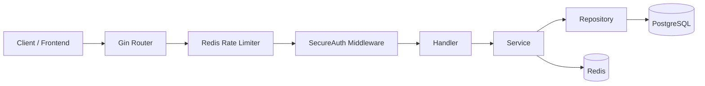

# Go Attendance API 🚀

::tech-badge-grid{ :badges="[{ text: 'Go 1.26.1', icon: 'https://img.icons8.com/color/48/000000/golang.png' }, { text: 'Gin Gonic', icon: 'https://raw.githubusercontent.com/gin-gonic/logo/master/color.png' }, { text: 'PostgreSQL', icon: 'https://img.icons8.com/color/48/000000/postgreesql.png' }, { text: 'Redis', icon: 'https://img.icons8.com/color/48/000000/redis.png' }, { text: 'Docker', icon: 'https://img.icons8.com/color/48/000000/docker.png' }, { text: 'Swagger', icon: 'https://static1.smartbear.co/swagger/media/assets/images/swagger_logo.svg' }]" }
::

Go Attendance API adalah backend HR dan absensi multi-tenant yang tangguh, dibangun menggunakan Go. Sistem ini mencakup autentikasi, manajemen karyawan, absensi, cuti, lembur, payroll, dashboard, timesheet, keuangan, performa, langganan, workflow support desk, dan administrasi platform.

Dibangun dengan **Gin**, **GORM**, **PostgreSQL**, dan **Redis**. Data tenant diisolasi melalui request context, sementara akses fitur dikontrol melalui role, permissions, dan fitur paket langganan.

---

## 📋 Table of Contents

- [Main Features](#main-features)
- [Architecture Overview](#architecture-overview)
- [Project Structure](#project-structure)
- [System Requirements](#system-requirements)
- [Environment Variables](#environment-variables)
- [Running the Project](#running-the-project)
- [Database, Migration, and Seeder](#database-migration-and-seeder)
- [Swagger](#swagger)
- [Authentication and Security Headers](#authentication-and-security-headers)
- [Main Endpoints](#main-endpoints)
- [Testing and Development Tools](#testing-and-development-tools)
- [Troubleshooting](#troubleshooting)

---

## ✨ Main Features

::feature-grid
  :::feature-item{icon="🏢" title="Multi-tenant HR System"}
  Isolasi data tingkat tenant yang aman untuk manajemen HR skala besar.
  :::
  :::feature-item{icon="🔐" title="JWT Auth"}
  Autentikasi melalui HTTP-only session cookie untuk keamanan maksimal.
  :::
  :::feature-item{icon="⏱️" title="Attendance Tracking"}
  Pelacakan presisi dengan Redis locking, cache invalidation, dan validasi GPS/waktu.
  :::
  :::feature-item{icon="💰" title="Payroll Engine"}
  Perhitungan gaji otomatis, profil payroll, payslip, dan sinkronisasi absensi.
  :::
  :::feature-item{icon="📊" title="Comprehensive Dashboards"}
  Admin, HR, Finance, Heatmap, Daily Pulse, dan Employee DNA dashboards.
  :::
  :::feature-item{icon="🗺️" title="Org Management"}
  Organization chart, positions, tenant roles, dan role hierarchy management.
  :::
::

### Detailed Capabilities:
- **HR Operations**: Shifts, roster, holiday calendar, dan employee lifecycle.
- **Timesheets**: Projects, tasks, dan laporan kerja karyawan.
- **Finance**: Expense management dan quota management.
- **Performance**: Goals, cycles, appraisals, dan self-reviews.
- **Subscriptions**: Plans, reminders, suspension, dan upgrades.
- **Support Desk**: Trial requests dan tenant provisioning.
- **Media**: Upload melalui ImgBB.
- **Email**: Transactional email melalui Resend.

---

## 🏗️ Architecture Overview

### Request Lifecycle



Main layers:
- `handler`: parses HTTP requests, binds payloads, dan mengembalikan response.
- `service`: berisi logika bisnis, orkestrasi, pengecekan keamanan, dan workflow.
- `repository`: menangani akses database dan query.
- `model`: berisi entitas GORM dan request/response models.
- `middleware`: menangani autentikasi, permissions, tenant context, anti-replay checks, dan rate limiting.
- `seeder`: menyediakan data awal untuk tenant, roles, demo users, plans, dan sample data.

### Multi-Tenant Flow 🌊
Setelah login, API mengembalikan session cookie bernama `access_token`. Pada rute yang dilindungi, middleware mengambil user dari token, mengecek status tenant, role, permissions, dan fitur plan. Tenant ID kemudian disuntikkan ke dalam request context agar query GORM dapat dibatasi sesuai tenant saat ini.

> **Superadmin** dapat melewati pembatasan tenant dengan `tenant_id = 0`, memungkinkan akses tingkat platform di seluruh tenant.

### Attendance Flow ⏱️
Absensi menggunakan Redis untuk mencegah request duplikat dan race conditions. Service melakukan validasi cepat, menyimpan data absensi, mencatat aktivitas terbaru, dan melakukan invalidasi cache absensi/dashboard yang terkait.

---

## 📁 Project Structure

```text
go-attendance-api/
├── cmd/
│   └── api/
│       └── main.go                  # Application entry point
├── docs/                            # Generated Swagger files
├── internal/
│   ├── config/                      # Database, Redis, tenant plugin
│   ├── dto/                         # Module-specific DTOs
│   ├── handler/                     # HTTP handlers
│   ├── middleware/                  # Auth, RBAC, tenant, rate limit
│   ├── model/                       # GORM models and request models
│   ├── repository/                  # Database access layer
│   ├── routes/                      # Route registration per module
│   ├── seeder/                      # Initial data for development/demo
│   ├── service/                     # Business logic
│   └── utils/                       # Response helpers, email, logger, preload
├── .air.toml                        # Hot reload config
├── docker-compose.yaml              # App, PostgreSQL, Redis
├── Dockerfile                       # Multi-stage Docker build
├── go.mod
├── go.sum
└── readme.md
```

---

## ⚙️ System Requirements

- **Go 1.26.1** (atau versi yang ditentukan di `go.mod`).
- **PostgreSQL 16** atau kompatibel.
- **Redis 7** atau kompatibel.
- **Docker & Docker Compose** untuk menjalankan dengan container.
- **swag CLI** untuk regenerasi Swagger docs secara lokal.
- **Air** untuk hot reload selama pengembangan.

---

## 🔑 Environment Variables

Salin file contoh environment:
```bash
cp .env.example .env
```

| Variable | Example | Description |
| --- | --- | --- |
| `APP_PORT` | `8085` | Port HTTP yang digunakan API. |
| `APP_ENV` | `development` | Jika `development`, anti-replay dan internal secret checks dilewati. |
| `DB_HOST` | `127.0.0.1` | Host PostgreSQL. Gunakan `db` di Docker Compose. |
| `DB_PORT` | `5432` | Port PostgreSQL. |
| `DB_USER` | `postgres` | Username PostgreSQL. |
| `DB_PASSWORD` | `1234` | Password PostgreSQL. |
| `DB_NAME` | `attendance-db` | Nama database PostgreSQL. |
| `REDIS_ADDR` | `127.0.0.1:6379` | Alamat Redis. Gunakan `redis:6379` di Docker Compose. |
| `JWT_SECRET` | `change-me` | Secret untuk tanda tangan token JWT. |
| `RUN_MIGRATION` | `true` | Menjalankan GORM AutoMigrate saat startup. |
| `RUN_SEEDER` | `false` | Menjalankan seeder saat startup. |

---

## 🚀 Running the Project

### Option 1: Local Development 💻
1. Pastikan PostgreSQL dan Redis menyala.
2. Atur `.env` (lihat bagian sebelumnya).
3. Jalankan:
   ```bash
   go mod download
   go run ./cmd/api/main.go
   ```
4. Dengan Hot Reload:
   ```bash
   air
   ```

### Option 2: Docker Compose 🐳
```bash
docker compose up -d --build
```

**Services:**
- **App**: `attendance-api` (Port 8085)
- **PostgreSQL**: `attendance-db` (Port 5433 host -> 5432 container)
- **Redis**: `attendance-redis` (Port 6380 host -> 6379 container)

---

## 🗄️ Database, Migration, and Seeder

Migrasi menggunakan `db.AutoMigrate` di `internal/config/database.go`.

Ketika `RUN_MIGRATION=true`, aplikasi akan:
1. Membuat ekstensi `uuid-ossp` di PostgreSQL.
2. Menjalankan migrasi bertahap berdasarkan dependensi model.
3. Seed paket langganan dasar.
4. Backfill tenant dan payroll profil yang belum ada.
5. Mengaktifkan GORM tenant plugin.

Ketika `RUN_SEEDER=true`, aplikasi akan membuat **Demo Data**:
- System tenant & Sample tenants.
- Roles, Permissions, & Hierarchy.
- Demo users (Superadmin, Admin, HR, Finance, Employee).
- Attendance history, Payroll profiles, Projects, & Support messages.

**Demo Accounts:**
- **Super Admin**: `superadmin@yopmail.com` | `123456`
- **Tenant Admin**: `admin@friendship.com` | `123456`

---

## 📖 Swagger

Swagger tersedia di:
`http://localhost:<APP_PORT>/swagger/index.html`

> Rute Swagger hanya terdaftar jika Gin tidak berjalan dalam mode `release`.

Regenerasi Swagger:
```bash
swag init -g cmd/api/main.go
```

---

## 🔒 Authentication and Security Headers

**Public Routes:**
- `POST /api/v1/auth/login`
- `GET /api/v1/ping`

**Protected Routes:** memerlukan cookie:
`Cookie: access_token=<jwt>`

Jika `APP_ENV` bukan `development`, memerlukan header tambahan:
- `X-Timestamp`: Unix milliseconds
- `X-Request-ID`: Unique request ID
- `X-Internal-Secret`: `<INTERNAL_SECRET>`
- `X-Signature`: HMAC SHA256 (Request body + timestamp + request ID)

---

## 🔌 Main Endpoints

| Module | Prefix | Description |
| --- | --- | --- |
| **Auth** | `/auth` | Login, Logout, Sessions, Password flows. |
| **Attendance** | `/attendance` | Clock in/out, history, summary. |
| **Users** | `/users`, `/employees` | Profile, employee list, user creation. |
| **Dashboard** | `/dashboards` | Admin, HR, finance, heatmap. |
| **Leave** | `/leaves` | Requests, balances, approval. |
| **Payroll** | `/payroll` | Calculation, generation, slips. |
| **Superadmin** | `/superadmin` | Platform-wide analytics & management. |

---

## 🧪 Testing and Development Tools

- **Run Tests**: `go test ./...`
- **Build Binary**: `go build -o ./tmp/main.exe ./cmd/api/main.go`
- **Format Code**: `gofmt -w ./cmd ./internal`

---

## 🛠️ Troubleshooting

- **Login fails with "JWT secret not configured"**: Isi `JWT_SECRET` di `.env`.
- **Protected route returns "Missing Session"**: Pastikan cookie `access_token` terkirim.
- **Swagger tidak muncul di Docker?**: Docker menggunakan `GIN_MODE=release`, ubah jika ingin melihat Swagger.
- **Redis/PostgreSQL Connection Error?** Cek `REDIS_ADDR` dan `DB_HOST`. Di Docker, gunakan nama service (`redis`, `db`).

---

## 📄 License

Proyek ini dilisensikan di bawah **MIT License**.
